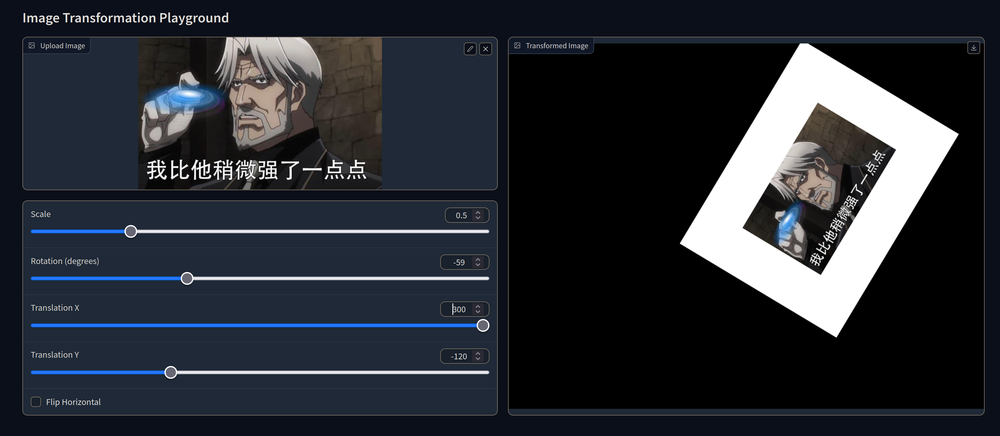

# Homework 01: Image Warping

This repository is the implementation of Image Warping.




The code and algorithm is straight forward, and necessary comments are included.

## Requirements

To install requirements:

```setup
pip install -r requirements.txt
```

Notice that, If you have a graphics card supporting CUDA, you can use the cuda-enhanced jax to maximize the performance.

See also [SETUP](../../SETUP.md).

## Evaluation

To evaluate my model on ImageNet, run:

```eval
python Assignments/01_ImageWarping/run_global_transform.py
python Assignments/01_ImageWarping/run_point_transform.py
```
