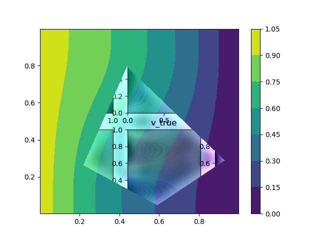
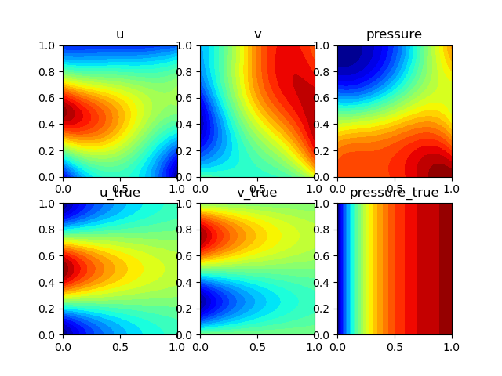
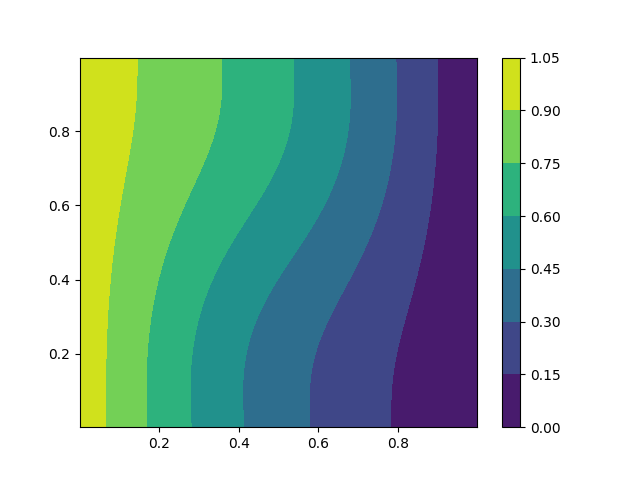
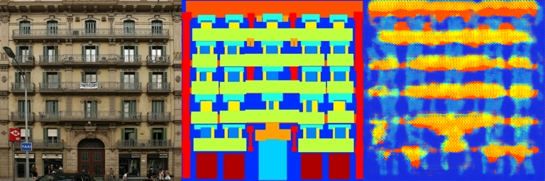

# DIP with PyTorch

This repository is the official implementation of [DIP with PyTorch](https://arxiv.org/abs/2030.12345). 

## Main Results

### Poisson image editing



Input are:

and


The mask generation is assuming your input is convex. The algorithm is just water filling.

### Pix2Pix



The architecture of network is just a simple U-Net architecture. To maximize training efficiency, I use
batch normalization and `LeakyReLU` in the CNN.

## Requirements

To install requirements:

```setup
pip install -r requirements.txt
```

## Training

To train the model(s) in the paper, run this command:

```train
# Poisson
python run_blending_gradio.py
# Pix2Pix
python Pix2Pix/train.py
```

>📋  Describe how to train the models, with example commands on how to train the models in your paper, including the full training procedure and appropriate hyperparameters.

