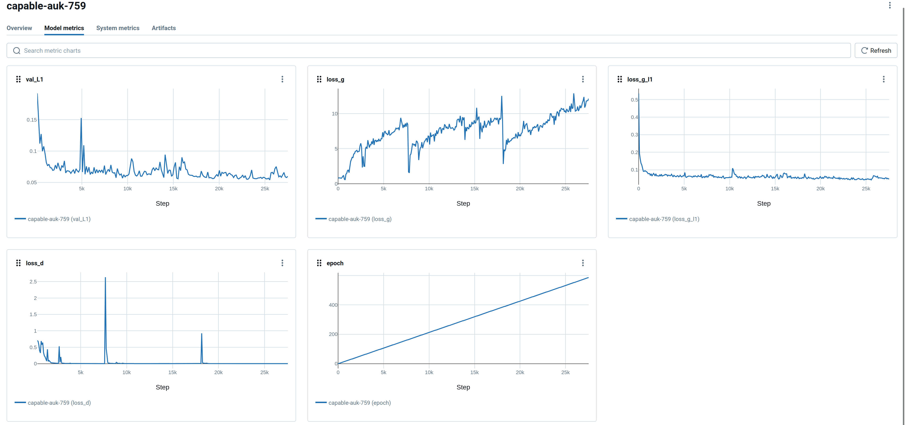
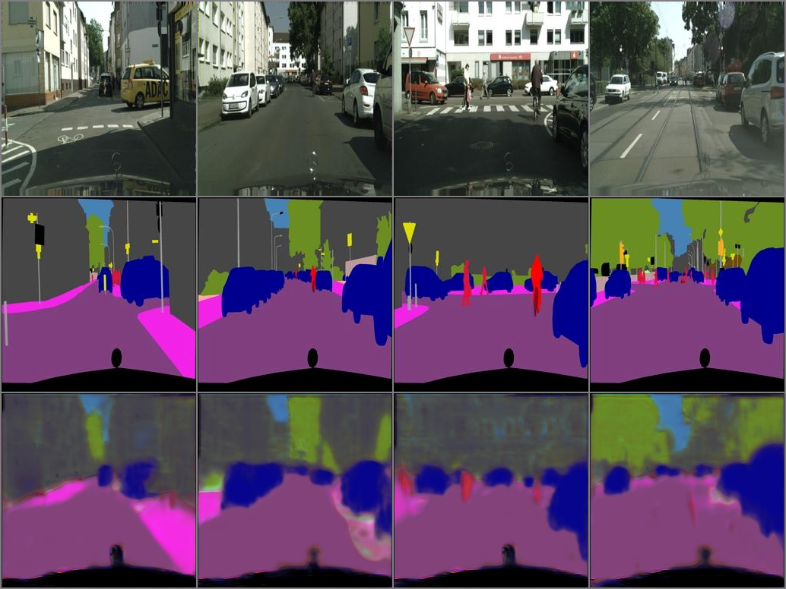

# Assignment 3 - Play with GANs

## Part 1: Pix2Pix with Discriminative Loss

Install these required packages:

- pytorch
- pytorch_lightning
- mlflow


To train the network, just:
```bash
python train.py
```


The loss curve is shown:




The final result in validation set is:

